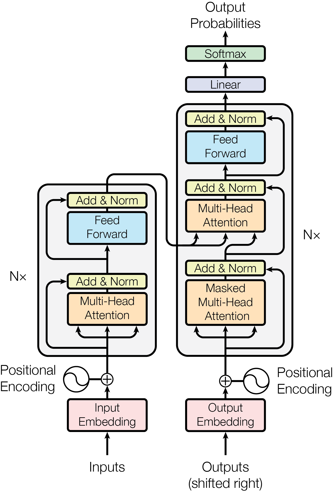
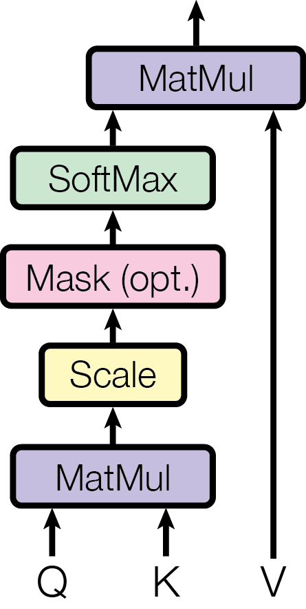
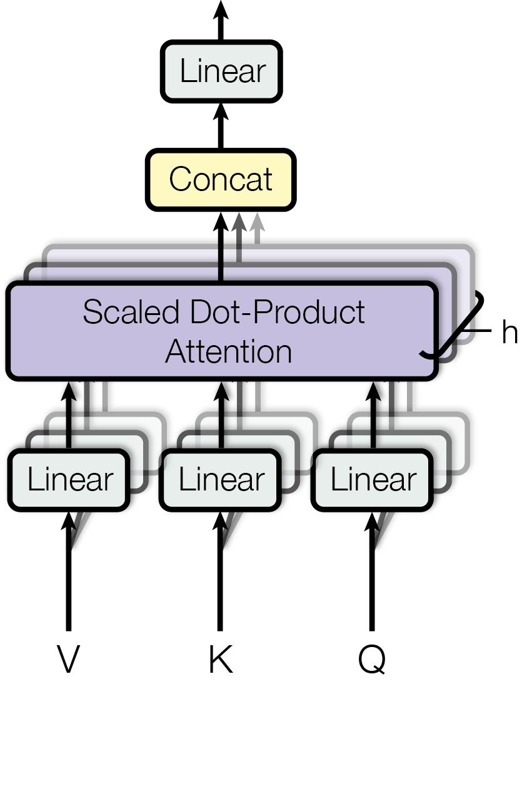
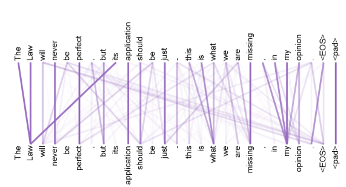
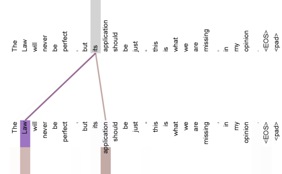
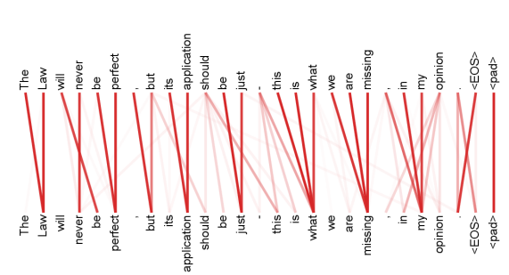

# [Attention is All You Need](https://arxiv.org/abs/1706.03762)

## Abstract

The dominant sequence transduction models are based on complex recurrent or convolutional neural networks that include an encoder and a decoder. The best performing models also connect the encoder and decoder through an attention mechanism.  

We propose a new simple network architecture, **the ==Transformer==, based ==solely on attention mechanisms==, dispensing with recurrence and convolutions entirely**.  

Experiments on two machine translation tasks show these models to be superior in quality while being **more ==parallelizable==** and requiring **significantly less time to train**. Our model achieves 28.4 BLEU on the WMT 2014 English-to-German translation task, improving over the existing best results, including ensembles, by over 2 BLEU. On the WMT 2014 English-to-French translation task, our model establishes a new single-model state-of-the-art BLEU score of 41.8 after training for 3.5 days on eight GPUs, a small fraction of the training costs of the best models from the literature. We show that the Transformer **generalizes well to other tasks** by applying it successfully to English constituency parsing both with large and limited training data.

## 1 Introduction

Recurrent neural networks, long short-term memory [13] and gated recurrent [7] neural networks in particular, have been firmly established as state of the art approaches in sequence modeling and transduction problems such as language modeling and machine translation [35, 2, 5]. Numerous efforts have since continued to push the boundaries of recurrent language models and encoder-decoder architectures [38, 24, 15].

Recurrent models typically factor computation **==along== the symbol positions** of the input and output sequences. **Aligning the positions to steps in computation time**, they generate a sequence of hidden states $h_t$, as a function of the previous hidden state $h_{t-1}$ and the input for position $t$.  
> factor`(v.)` computation: 分解计算

**This ==inherently sequential== nature precludes parallelization within training examples**, which becomes critical at longer sequence lengths, as **memory constraints limit batching across examples**.  

Recent work has achieved significant improvements in computational efficiency through **factorization tricks** [21] and **conditional computation** [32], while also improving model performance in case of the latter. The fundamental constraint of sequential computation, however, remains.
> factorization tricks: 将大矩阵或复杂运算分解为多个小矩阵或简单运算的组合  
  conditional computation: 根据输入动态决定哪些部分需要计算，跳过不相关的子网络

Attention mechanisms have become an integral part of compelling **sequence modeling** and **transduction models** in various tasks, **allowing modeling of dependencies without regard to their distance** in the input or output sequences [2, 19]. In all but a few cases [27], however, such attention mechanisms are used in conjunction with a recurrent network.

In this work we propose the **Transformer**, a model architecture eschewing recurrence and instead **relying entirely on an attention mechanism to draw ==global dependencies between input and output==**. The Transformer allows for significantly more parallelization and can reach a new state of the art in translation quality after being trained for as little as twelve hours on eight P100 GPUs.

## 2 Background

The goal of reducing sequential computation also forms the foundation of the Extended Neural GPU [16], ByteNet [18] and ConvS2S [9], all of which use convolutional neural networks as basic building block, computing hidden representations in parallel for all input and output positions. **In these models, the number of operations required to relate signals from two arbitrary input or output positions grows in the distance between positions**, linearly for ConvS2S and logarithmically for ByteNet. This makes it more **difficult to learn dependencies between distant positions** [12].  

**In the Transformer this is reduced to ==a constant number== of operations, albeit at the cost of ==reduced effective resolution== due to averaging attention-weighted positions, an effect we counteract with ==Multi-Head Attention==** as described in section 3.2.
> 通过自注意力，任意两个位置可以直接交互，路径长度为 O(1)。代价是单头注意力的加权平均本质导致模糊细节，混合语义，分辨率降低。通过多头注意力缓解。

**Self-attention**, sometimes called intra-attention **is an attention mechanism relating different positions of ==a single sequence== in order to ==compute a representation of the sequence==.** Self-attention has been used successfully in a variety of tasks including reading comprehension, abstractive summarization, textual entailment and learning task-independent sentence representations [4, 27, 28, 22].

End-to-end memory networks are based on a recurrent attention mechanism instead of sequence-aligned recurrence and have been shown to perform well on simple-language question answering and language modeling tasks [34].

To the best of our knowledge, however, the Transformer is the first transduction model relying entirely on self-attention to compute representations of its input and output without using sequence-aligned RNNs or convolution. In the following sections, we will describe the Transformer, motivate self-attention and discuss its advantages over models such as [17, 18] and [9].

## 3 Model Architecture

Most competitive neural sequence transduction models have an **==encoder-decoder== structure** [5, 2, 35]. Here, the encoder maps an input sequence of **symbol representations** ( $x_1, \ldots, x_n$ ) to a sequence of **continuous representations** $\mathbf{z}=\left(z_1, \ldots, z_n\right)$. Given $\mathbf{z}$, the decoder then generates an output sequence ( $y_1, \ldots, y_m$ ) of symbols **one element at a time**. At each step the model is **==auto-regressive==** [10], **consuming the previously generated symbols as additional input when generating the next**.

The Transformer follows this overall architecture using **stacked self-attention** and **point-wise, fully connected layers** for both the encoder and decoder, shown in the left and right halves of Figure 1, respectively.

### 3.1 Encoder and Decoder Stacks

#### Encoder:

The encoder is composed of a stack of **$N=6$ identical layers**. **Each layer has two sub-layers**. The first is a **multihead self-attention mechanism**, and the second is a simple, **==position-wise== fully connected feed-forward network**.  

We employ a **==residual connection==** [11] around each of the two sub-layers, followed by **layer normalization** [1]. That is, the output of each sub-layer is $\operatorname{LayerNorm}(x+\operatorname{Sublayer}(x))$, where $\operatorname{Sublayer}(x)$ is the function implemented by the sub-layer itself.  

To facilitate these residual connections, all sub-layers in the model, as well as the embedding layers, produce **outputs of dimension $d_{\text {model }}=512$**.

#### Decoder:

The decoder is also composed of a stack of **$N=6$ identical layers**. In addition to the two sub-layers in each encoder layer, the decoder **inserts a third sub-layer**, **which performs multi-head attention ==over the output of the encoder stack==**.  

Similar to the encoder, we employ **residual connections** around each of the sub-layers, followed by **layer normalization**.  

We also modify the self-attention sub-layer in the decoder stack to **prevent positions from attending to subsequent positions**. This ==**masking**==, combined with fact that **the output embeddings are ==offset by one position==**, ensures that the predictions for position $i$ can depend only on the known outputs at positions less than $i$.

### 3.2 Attention

An attention function can be described as **mapping a ==query== and a set of ==key-value== pairs to an output**, where the query, keys, values, and output are all vectors. The output is computed as **a weighted sum of the values**, where the weight assigned to each value is computed by **a compatibility function of the query with the corresponding key**.

#### 3.2.1 Scaled Dot-Product Attention

> MatMul for Matrix Multiplication

We call our particular attention "Scaled Dot-Product Attention" (Figure 2). **The input consists of queries and keys of dimension $d_k$, and values of dimension $d_v$**.  
We compute **the ==dot products== of the query with all keys**, divide each by $\sqrt{d_k}$, and apply a **softmax** function to obtain the weights on the values.

In practice, we compute the attention function **on a set of queries simultaneously**, packed together into a matrix $Q$. The keys and values are also packed together into matrices $K$ and $V$. We compute the matrix of outputs as:

$$
\text { Attention }(Q, K, V)=\operatorname{softmax}\left(\frac{Q K^T}{\sqrt{d_k}}\right) V
$$

The two most commonly used attention functions are additive attention [2], and dot-product (multiplicative) attention. Dot-product attention is identical to our algorithm, except for the **scaling factor** of $\frac{1}{\sqrt{d_k}}$. Additive attention computes the compatibility function using a feed-forward network with a single hidden layer. While the two are similar in theoretical complexity, **dot-product attention is much faster and more space-efficient** in practice, since it can be implemented using highly optimized matrix multiplication code.

While for small values of $d_k$ the two mechanisms perform similarly, additive attention outperforms dot product attention without scaling for larger values of $d_k$ [3].  
**We suspect that for large values of $d_k$, the dot products grow large in magnitude, pushing the softmax function into regions where it has ==extremely small gradients== $^1$**. To counteract this effect, we scale the dot products by $\frac{1}{\sqrt{d_k}}$.

#### 3.2.2 Multi-Head Attention

> QKV抽象接口

Instead of performing a single attention function with $d_{\text {model }}$-dimensional keys, values and queries, **we found it beneficial to linearly project the queries, keys and values $h$ times with ==different, learned linear projections== to $d_k, d_k$ and $d_v$ dimensions**, respectively.  
On each of these projected versions of queries, keys and values we then perform the attention function in parallel, yielding **$d_v$-dimensional output values**. These are **==concatenated and once again projected==**, resulting in the final values, as depicted in Figure 2.

**Multi-head attention allows the model to jointly attend to information ==from different representation subspaces== at different positions. With a single attention head, averaging inhibits this.**

$$
\begin{aligned}
\operatorname{MultiHead}(Q, K, V) & =\operatorname{Concat}\left(\operatorname{head}_1, \ldots, \operatorname{head}_{\mathrm{h}}\right) W^O \\
\text { where } \operatorname{head}_{\mathrm{i}} & =\operatorname{Attention}\left(Q W_i^Q, K W_i^K, V W_i^V\right)
\end{aligned}
$$

Where the projections are parameter matrices $W_i^Q \in \mathbb{R}^{d_{\text {model }} \times d_k}, \quad W_i^K \in \mathbb{R}^{d_{\text {model }} \times d_k}, \quad W_i^V \in \mathbb{R}^{d_{\text {model }} \times d_v} \quad$ and $W^O \in \mathbb{R}^{h d_v \times d_{\text {model }}}$.

In this work we employ $h=8$ parallel attention layers, or heads. For each of these we use $d_k=d_v=d_{\text {model }} / h=64$. **Due to the reduced dimension of each head, the total computational cost is similar to that of single-head attention with full dimensionality**.

#### 3.2.3 Applications of Attention in our Model

The Transformer uses multi-head attention in three different ways:

> Cross Attention

- In "encoder-decoder attention" layers, **the queries come from the previous decoder layer, and the memory keys and values come from the output of the encoder**. **This allows ==every position in the decoder to attend over all positions in the input sequence==**. This mimics the typical encoder-decoder attention mechanisms in sequence-to-sequence models such as [38, 2, 9].

> Self-Attention

- The encoder contains self-attention layers. In a self-attention layer all of the keys, values and queries come from the same place, in this case, **the output of the previous layer in the encoder**. **==Each position in the encoder can attend to all positions in the previous layer of the encoder.==**

> Masked Self-Attention

- Similarly, self-attention layers in the decoder allow each position in the decoder to attend to all positions in the decoder up to and including that position. We need to **==prevent leftward information flow==** in the decoder to preserve the auto-regressive property. We implement this inside of scaled dot-product attention by masking out (**setting to $-\infty$** ) all values in the input of the softmax which correspond to illegal connections. See Figure $\underline{2}$.

### 3.3 Position-wise Feed-Forward Networks

In addition to attention sub-layers, each of the layers in our encoder and decoder contains **a fully connected feedforward network**, which is applied to each position separately and identically. This consists of two linear transformations with a ReLU activation in between.

$$
\operatorname{FFN}(x)=\max \left(0, x W_1+b_1\right) W_2+b_2
$$

While **the linear transformations are the same across different positions, they use different parameters from layer to layer**. Another way of describing this is as two convolutions with kernel size 1 . The dimensionality of input and output is $d_{\text {model }}=512$, and the inner-layer has dimensionality $d_{f f}=2048$.

### 3.4 Embeddings and Softmax

Similarly to other sequence transduction models, we **use learned embeddings to convert the input tokens and output tokens to vectors of dimension $d_{\text {model }}$**. We also use the usual learned linear transformation and softmax function to **convert the decoder output to predicted next-token probabilities**.  
In our model, we **share the same weight matrix between the two embedding layers and the pre-softmax linear transformation**, similar to [30]. In the embedding layers, we multiply those weights by $\sqrt{d_{\text {model }}}$
> $W_{out}=W_{emb}^T$

### 3.5 Positional Encoding

Since our model contains no recurrence and no convolution, in order for the model **to make use of the order of the sequence**, we must inject some information about the relative or absolute position of the tokens in the sequence. To this end, we **add "positional encodings" to the input embeddings at the bottoms of the encoder and decoder stacks**. The positional encodings have the same dimension $d_{\text {model }}$ as the embeddings, so that the two can **be summed**. There are many choices of positional encodings, learned and fixed [9].

In this work, we use sine and cosine functions of **==different frequencies==**:

$$
\begin{aligned}
P E_{(p o s, 2 i)} & =\sin \left(p o s / 10000^{2 i / d_{\text {model }}}\right) \\
P E_{(p o s, 2 i+1)} & =\cos \left(p o s / 10000^{2 i / d_{\text {model }}}\right)
\end{aligned}
$$

where pos is the position and $i$ is the dimension. That is, each dimension of the positional encoding corresponds to a sinusoid. The wavelengths form a geometric progression from $2 \pi$ to $10000 \cdot 2 \pi$. We chose this function because we hypothesized **it would allow the model to easily learn to attend by relative positions, since for any fixed offset $k$, $P E_{p o s+k}$ can be represented as a linear function of $P E_{p o s}$**.

We also experimented with using learned positional embeddings [9] instead, and found that the two versions produced nearly identical results (see Table $\underline{3}$ row (E)). We chose the sinusoidal version because it may **allow the model to extrapolate to sequence lengths longer than the ones encountered during training**.

> 前面的维度波长短，不同位置的值差异大，适合捕捉局部、精细的位置变化  
后面的维度波长长，不同位置的值差异小，适合捕捉全局、粗略的位置趋势

## 4 Why Self-Attention

In this section we compare various aspects of self-attention layers to the recurrent and convolutional layers commonly used for mapping one variable-length sequence of symbol representations ( $x_1, \ldots, x_n$ ) to another sequence of equal length $\left(z_1, \ldots, z_n\right)$, with $x_i, z_i \in \mathbb{R}^d$, such as a hidden layer in a typical sequence transduction encoder or decoder. Motivating our use of self-attention we consider three desiderata.

One is the **total computational complexity** per layer. Another is the amount of computation that can be **parallelized**, as measured by **the minimum number of sequential operations** required.

The third is **the path length between long-range dependencies** in the network. Learning long-range dependencies is a key challenge in many sequence transduction tasks. One key factor affecting the ability to learn such dependencies is the length of the paths forward and backward signals have to traverse in the network. **The shorter these paths between any combination of positions in the input and output sequences, the easier it is to learn long-range dependencies** [12]. Hence we also compare **the maximum path length between any two input and output positions** in networks composed of the different layer types.

> Table 1: Maximum path lengths, per-layer complexity and minimum number of sequential operations for different layer types. $n$ is the sequence length, $d$ is the representation dimension, $k$ is the kernel size of convolutions and $r$ the size of the neighborhood in restricted self-attention.

| Layer Type | Complexity per Layer | Sequential Operations | Maximum Path Length |
|:---:|:---:|:---:|:---:|
| Self-Attention | $O(n^2 \cdot d)$ | $O(1)$ | $O(1)$ |
| Recurrent | $O(n \cdot d^2)$ | $O(n)$ | $O(n)$ |
| Convolutional | $O(k \cdot n \cdot d^2)$ | $O(1)$ | $O(\log_k n)$ |
| Self-Attention (restricted) | $O(r \cdot n \cdot d)$ | $O(1)$ | $O(n / r)$ |

As noted in Table 1, **a self-attention layer connects all positions with a constant number of sequentially executed operations**, whereas a recurrent layer requires $O(n)$ sequential operations. In terms of computational complexity, self-attention layers are faster than recurrent layers when the sequence length $n$ is smaller than the representation dimensionality $d$, which is most often the case with sentence representations used by state-of-the-art models in machine translations, such as word-piece [38] and byte-pair [31] representations. **To improve computational performance for tasks involving very long sequences, self-attention could be restricted to considering only a neighborhood of size $r$ in the input sequence centered around the respective output position**. This would increase the maximum path length to $O(n / r)$. We plan to investigate this approach further in future work.

A single convolutional layer with kernel width $k<n$ does not connect all pairs of input and output positions. Doing so requires a stack of $O(n / k)$ convolutional layers in the case of contiguous kernels, or $O\left(\log _k(n)\right)$ in the case of dilated convolutions [18], increasing the length of the longest paths between any two positions in the network. Convolutional layers are generally more expensive than recurrent layers, by a factor of $k$. Separable convolutions [6], however, decrease the complexity considerably, to $O\left(k \cdot n \cdot d+n \cdot d^2\right)$. Even with $k=n$, however, the complexity of a separable convolution is equal to the combination of a self-attention layer and a point-wise feed-forward layer, the approach we take in our model.

As side benefit, self-attention could yield **more interpretable** models. We inspect attention distributions from our models and present and discuss examples in the appendix. **Not only do individual attention heads clearly learn to perform different tasks, many appear to exhibit behavior related to the syntactic and semantic structure of the sentences**.

## 5 Training

This section describes the training regime for our models.

### 5.1 Training Data and Batching

We trained on the standard WMT 2014 English-German dataset consisting of about 4.5 million sentence pairs. Sentences were encoded using byte-pair encoding [3], which has a shared source-target vocabulary of about 37000 tokens. For English-French, we used the significantly larger WMT 2014 English-French dataset consisting of 36M sentences and split tokens into a 32000 word-piece vocabulary [38]. **Sentence pairs were batched together by approximate sequence length**. Each training batch contained a set of sentence pairs containing **approximately 25000 source tokens and 25000 target tokens**.

### 5.2 Hardware and Schedule

We trained our models on one machine with 8 NVIDIA P100 GPUs. For our base models using the hyperparameters described throughout the paper, each training step took about 0.4 seconds. We trained the base models for a total of 100,000 steps or 12 hours. For our big models,(described on the bottom line of table $\underline{3}$ ), step time was 1.0 seconds. The big models were trained for 300,000 steps ( 3.5 days).

### 5.3 Optimizer

We used the Adam optimizer [20] with $\beta_1=0.9, \beta_2=0.98$ and $\epsilon=10^{-9}$. We varied the learning rate over the course of training, according to the formula:

$$
\text { lrate }=d_{\text {model }}^{-0.5} \cdot \min \left(\text { step-num }^{-0.5}, \text { step-num } \cdot \text { warm-upsteps }^{-1.5}\right)
$$

**This corresponds to increasing the learning rate linearly for the first ==warmup_steps== training steps, and decreasing it thereafter proportionally to the inverse square root of the step number**. We used warmup_steps $=4000$.

> 随机参数 $\neq$ 无结构，学习初期需防止破坏

### 5.4 Regularization

We employ three types of regularization during training:

#### Residual Dropout

We apply dropout [33] to the output of each sub-layer, **before it is added to the sub-layer input and normalized**. In addition, we apply dropout to **the sums of the embeddings and the positional encodings** in both the encoder and decoder stacks. For the base model, we use a rate of $P_{\text {drop }}=0.1$.

#### Label Smoothing

During training, we employed label smoothing of value $\epsilon_{l s}=0.1$ [36]. **This hurts perplexity, as the model learns to be more unsure, but improves accuracy and BLEU score**.

> label smoothing: 例如$[0,1,0]\to[0.05,0.90,0.05],(\epsilon_{ls}=0.1)$

## 6 Results

## 7 Conclusion

In this work, we presented **the Transformer, the first sequence transduction model based entirely on attention**, replacing the recurrent layers most commonly used in encoder-decoder architectures with multi-headed self-attention.

For translation tasks, the Transformer can be trained significantly faster than architectures based on recurrent or convoIutional layers. On both WMT 2014 English-to-German and WMT 2014 English-to-French translation tasks, we achieve a new state of the art. In the former task our best model outperforms even all previously reported ensembles.

We are excited about the future of attention-based models and plan to apply them to other tasks. We plan to extend the Transformer to problems involving input and output modalities other than text and to investigate local, restricted attention mechanisms to efficiently handle large inputs and outputs such as images, audio and video. Making generation less sequential is another research goals of ours.

The code we used to train and evaluate our models is available at https://github.com/tensorflow/tensor2tensor .

## Acknowledgements

We are grateful to Nal Kalchbrenner and Stephan Gouws for their fruitful comments, corrections and inspiration.

## References

## Attention Visualizations

