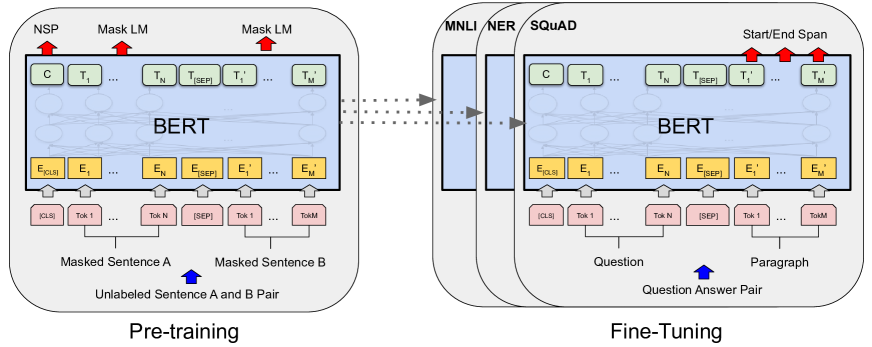

# [BERT: Pre-training of Deep Bidirectional Transformers for Language Understanding](https://arxiv.org/abs/1810.04805)

## Abstract

We introduce a new language representation model called BERT, which stands for ==**B**idirectional **E**ncoder **R**epresentations from **T**ransformers==. Unlike recent language representation models (Peters et al., 2018a; Radford et al., 2018), BERT is designed to **pretrain deep bidirectional representations from unlabeled text by jointly conditioning on both left and right context in all layers**. As a result, the pre-trained BERT model can **be finetuned with just ==one additional output layer==** to create state-of-the-art models for a wide range of tasks, such as question answering and language inference, without substantial taskspecific architecture modifications.

BERT is conceptually simple and empirically powerful. It obtains new state-of-the-art results on eleven natural language processing tasks, including pushing the GLUE score to $80.5 \%$ ( $7.7 \%$ point absolute improvement), MultiNLI accuracy to $86.7 \%$ ( $4.6 \%$ absolute improvement), SQuAD v1.1 question answering Test F1 to 93.2 (1.5 point absolute improvement) and SQuAD v2.0 Test F1 to 83.1 (5.1 point absolute improvement).

## 1 Introduction

Language model pre-training has been shown to be effective for improving many natural language processing tasks (Dai and Le, 2015; Peters et al., 2018a; Radford et al., 2018; Howard and Ruder, 2018). These include **==sentence-level==** tasks such as natural language inference (Bowman et al., 2015; Williams et al., 2018) and paraphrasing (Dolan and Brockett, 2005), which aim to predict the relationships between sentences by analyzing them holistically, as well as **==token-level==** tasks such as named entity recognition and question answering, where models are required to produce fine-grained output at the token level (Tjong Kim Sang and De Meulder, 2003; Rajpurkar et al., 2016).

There are two existing strategies for applying pre-trained language representations to downstream tasks: **feature-based** and **fine-tuning**. The feature-based approach, such as ELMo (Peters et al., 2018a), uses **task-specific architectures** that **include the pre-trained representations as additional features**. The fine-tuning approach, such as the Generative Pre-trained Transformer (OpenAI GPT) (Radford et al., 2018), introduces minimal task-specific parameters, and is trained on the downstream tasks by **simply fine-tuning all pretrained parameters**. The two approaches share the same objective function during pre-training, where they use **unidirectional** language models to learn general language representations.

We argue that current techniques restrict the power of the pre-trained representations, especially for the fine-tuning approaches. The major limitation is that standard language models are unidirectional, and this limits the choice of architectures that can be used during pre-training. For example, in Open AI GPT, the authors use a left-to-right architecture, where every token can only attend to previous tokens in the self-attention layers of the Transformer (Vaswani et al., 2017). **Such restrictions are sub-optimal for sentence-level tasks, and could be very harmful when applying fine-tuning based approaches to token-level tasks such as question answering, where it is ==crucial to incorporate context from both directions==.**

In this paper, we improve the fine-tuning based approaches by proposing BERT: Bidirectional Encoder Representations from Transformers. BERT alleviates the previously mentioned unidirectionality constraint by using a **=="masked language model" (MLM)== pre-training objective**, inspired by the Cloze task (Taylor, 1953). **The masked language model randomly masks some of the tokens from the input, and the objective is to predict the original vocabulary id of the masked word based only on its context**. Unlike left-to-right language model pre-training, the MLM objective enables the representation to fuse the left and the right context, which allows us to pretrain **a deep bidirectional Transformer**. In addition to the masked language model, we also use a **"==next sentence prediction=="** task that jointly pretrains text-pair representations. The contributions of our paper are as follows:

> BERT 的 Next Sentence Prediction (NSP) 任务后来被多项研究（尤其是 RoBERTa）证明对下游任务的提升非常有限，甚至在某些情况下有害。但是取消 NSP 并不意味着 [CLS] 失去作用。

- We demonstrate the importance of **bidirectional pre-training** for language representations. Unlike Radford et al. (2018), which uses unidirectional language models for pre-training, BERT uses masked language models to enable pretrained deep bidirectional representations. This is also in contrast to Peters et al. (2018a), which uses a shallow concatenation of independently trained left-to-right and right-to-left LMs.
- We show that pre-trained representations **reduce the need for many heavily-engineered taskspecific architectures**. BERT is the first fine-tuning based representation model that achieves state-of-the-art performance on a large suite of sentence-level and token-level tasks, outperforming many task-specific architectures.
- BERT advances the state of the art for eleven NLP tasks. The code and pre-trained models are available at https://github.com/ google-research/bert.

## 2 Related Work

There is a long history of pre-training general language representations, and we briefly review the most widely-used approaches in this section.

### 2.1 Unsupervised Feature-based Approaches

Learning widely applicable representations of words has been an active area of research for decades, including non-neural (Brown et al., 1992; Ando and Zhang, 2005; Blitzer et al., 2006) and neural (Mikolov et al., 2013; Pennington et al., 2014) methods. Pre-trained word embeddings are an integral part of modern NLP systems, offering significant improvements over embeddings learned from scratch (Turian et al., 2010). **To pretrain word embedding vectors, left-to-right language modeling objectives have been used** (Mnih and Hinton, 2009), as well as **objectives to discriminate correct from incorrect words in left and right context** (Mikolov et al., 2013).

These approaches have been generalized to **coarser granularities**, such as **sentence embeddings** (Kiros et al., 2015; Logeswaran and Lee, 2018) or **paragraph embeddings** (Le and Mikolov, 2014). To train sentence representations, prior work has used objectives to **rank candidate next sentences** (Jernite et al., 2017; Logeswaran and Lee, 2018), **left-to-right generation of next sentence words** given a representation of the previous sentence (Kiros et al., 2015), or **denoising autoencoder derived objectives** (Hill et al., 2016).

ELMo and its predecessor (Peters et al., 2017, 2018a) generalize traditional word embedding research along a different dimension. They extract **context-sensitive** features from a left-to-right and a right-to-left language model. The contextual representation of each token is the concatenation of the left-to-right and right-to-left representations. When integrating contextual word embeddings with existing task-specific architectures, ELMo advances the state of the art for several major NLP benchmarks (Peters et al., 2018a) including question answering (Rajpurkar et al., 2016), sentiment analysis (Socher et al., 2013), and named entity recognition (Tjong Kim Sang and De Meulder, 2003). Melamud et al. (2016) proposed learning contextual representations through a task to predict a single word from both left and right context using LSTMs. Similar to ELMo, their model is **feature-based and not deeply bidirectional**. Fedus et al. (2018) shows that **the ==cloze== task** can be used to improve the robustness of text generation models.

### 2.2 Unsupervised Fine-tuning Approaches

As with the feature-based approaches, the first works in this direction **only pre-trained word embedding parameters from unlabeled text** (Collobert and Weston, 2008).

More recently, sentence or document encoders which produce contextual token representations have been pre-trained from unlabeled text and fine-tuned for a supervised downstream task (Dai and Le, 2015; Howard and Ruder, 2018; Radford et al., 2018). The advantage of these approaches is that **few parameters need to be learned from scratch**. At least partly due to this advantage, **OpenAI GPT** (Radford et al., 2018) achieved previously state-of-the-art results on many sentencelevel tasks from the GLUE benchmark (Wang et al., 2018a). **Left-to-right language modeling and auto-encoder objectives have been used for pre-training such models** (Howard and Ruder, 2018; Radford et al., 2018; Dai and Le, 2015).

### 2.3 Transfer Learning from Supervised Data

There has also been work showing effective transfer from supervised tasks with large datasets, such as natural language inference (Conneau et al., 2017) and machine translation (McCann et al., 2017). Computer vision research has also demonstrated the importance of **transfer learning from large pre-trained models**, where an effective recipe is to fine-tune models pre-trained with ImageNet (Deng et al., 2009; Yosinski et al., 2014).

## 3 BERT

Figure 1: Overall pre-training and fine-tuning procedures for BERT. Apart from output layers, the same architectures are used in both pre-training and fine-tuning. The same pre-trained model parameters are used to initialize models for different down-stream tasks. During fine-tuning, all parameters are fine-tuned. [CLS] is a special symbol added in front of every input example, and [SEP] is a special separator token (e.g. separating questions/answers).

We introduce BERT and its detailed implementation in this section. There are two steps in our framework: **==pre-training and fine-tuning==**. During pre-training, the model is **trained on unlabeled data** over different pre-training tasks. For finetuning, the BERT model is first initialized with the pre-trained parameters, and all of the parameters are **fine-tuned using labeled data from the downstream tasks**. Each downstream task has separate fine-tuned models, even though they are initialized with the same pre-trained parameters. The question-answering example in Figure 1 will serve as a running example for this section.

A distinctive feature of BERT is its unified architecture across different tasks. There is **minimal difference** between the pre-trained architecture and the final downstream architecture.

**Model Architecture**  
BERT's model architecture is a **==multi-layer bidirectional Transformer encoder==** based on the original implementation described in Vaswani et al. (2017) and released in the tensor2tensor library. ${ }^1$ Because the use of Transformers has become common and our implementation is almost identical to the original, we will omit an exhaustive background description of the model architecture and refer readers to Vaswani et al. (2017) as well as excellent guides such as "The Annotated Transformer." ${ }^2$

In this work, we denote the number of layers (i.e., Transformer blocks) as $L$, the hidden size as $H$, and the number of self-attention heads as $A .^3$ We primarily report results on two model sizes: BERT $_{\text {BASE }}(\mathrm{L}=12, \mathrm{H}=768, \mathrm{~A}=12$, Total Parameters $=110 \mathrm{M}$ ) and BERT ${ }_{\text {LARGE }}(\mathrm{L}=24, \mathrm{H}=1024$, $\mathrm{A}=16$, Total Parameters $=340 \mathrm{M}$ ).

BERT $_{\text {BASE }}$ was chosen to have the same model size as OpenAI GPT for comparison purposes. Critically, however, the BERT Transformer uses **bidirectional self-attention**, while the GPT Transformer uses constrained self-attention where every token can only attend to context to its left. ${ }^4$

**Input/Output Representations**  
To make BERT handle a variety of down-stream tasks, our input representation is able to unambiguously represent both **a single sentence and a pair of sentences** (e.g., 〈 Question, Answer 〉) in one token sequence. Throughout this work, **a "==sentence==" can be an arbitrary span of contiguous text, rather than an actual linguistic sentence. A "==sequence==" refers to the input token sequence to BERT, which may be a single sentence or two sentences packed together.**

We use WordPiece embeddings (Wu et al., 2016) with a 30,000 token vocabulary. **The first token of every sequence is always a special classification token (==[CLS]==). The final hidden state corresponding to this token is used as the aggregate sequence representation for classification tasks.**

> [CLS] for sentence-level tasks

**Sentence pairs are packed together into a single sequence.** We differentiate the sentences in two ways. First, we **separate them with a special token (==[SEP]==)**. Second, we add **a learned embedding to every token** indicating whether it belongs to sentence A or sentence B. As shown in Figure 1, we denote input embedding as $E$, the final hidden vector of the special [CLS] token as $C \in \mathbb{R}^H$, and the final hidden vector for the $i^{\text {th }}$ input token as $T_i \in \mathbb{R}^H$.

> $H$ for hidden size

For a given token, its input representation is constructed by **summing the corresponding token, ==segment==, and position embeddings**. A visualization of this construction can be seen in Figure 2.

Figure 2:BERT input representation. The input embeddings are the sum of the token embeddings, the segmentation embeddings and the position embeddings.

### 3.1 Pre-training BERT

Unlike Peters et al. (2018a) and Radford et al. (2018), we do not use traditional left-to-right or right-to-left language models to pre-train BERT. Instead, we pre-train BERT using **two unsupervised tasks**, described in this section. This step is presented in the left part of Figure 1.

**Task \#1: Masked LM**  
Intuitively, it is reasonable to believe that a deep bidirectional model is strictly more powerful than either a left-to-right model or the shallow concatenation of a left-toright and a right-to-left model. Unfortunately, standard conditional language models can only be trained left-to-right or right-to-left, since **bidirectional conditioning would allow each word to indirectly "see itself", and the model could trivially predict the target word in a multi-layered context**.

> 多层网络中，即使没有显式把当前词输入给预测器，深层的上下文表示可能已经“泄露”了当前词的信息。因此必须采取掩码。

In order to train a deep bidirectional representation, **we simply mask some percentage of the input tokens at random, and then predict those masked tokens**. We refer to this procedure as a "masked LM" (MLM), although it is often referred to as a Cloze task in the literature (Taylor, 1953). In this case, **the final hidden vectors corresponding to the mask tokens are fed into an output softmax over the vocabulary**, as in a standard LM. In all of our experiments, we mask $15 \%$ of all WordPiece tokens in each sequence at random. In contrast to denoising auto-encoders (Vincent et al., 2008), we only predict the masked words rather than reconstructing the entire input.

> 损失函数仅作用于掩码位置而非重建全句。重建未 mask 词的任务对学习上下文表示几乎没有帮助，反而浪费计算、干扰优化。而对于之后的BART，由于输入被大幅破坏，重建全句是必要的。

Although this allows us to obtain a bidirectional pre-trained model, **==a downside is that we are creating a mismatch between pre-training and fine-tuning==, since the [MASK] token does not appear during fine-tuning**. To mitigate this, we do not always replace "masked" words with the actual [MASK] token. The training data generator chooses 15\% of the token positions at random for prediction. If the $i$-th token is chosen, **we replace the $i$-th token with (1) the [MASK] token $80 \%$ of the time (2) a random token $10 \%$ of the time (3) the unchanged $i$-th token $10 \%$ of the time**. Then, $T_i$ will be used to predict the original token with cross entropy loss. We compare variations of this procedure in Appendix C.2.

**Task \#2: Next Sentence Prediction (NSP)**  
Many important downstream tasks such as Question Answering (QA) and Natural Language Inference (NLI) are based on understanding **the relationship between two sentences**, which is not directly captured by language modeling. In order to train a model that understands sentence relationships, we pre-train for a **binarized** next sentence prediction task that can be trivially generated from any monolingual corpus. Specifically, when choosing the sentences $A$ and $B$ for each pretraining example, **$50 \%$ of the time B is the actual next sentence that follows A (labeled as IsNext), and $50 \%$ of the time it is a random sentence from the corpus (labeled as NotNext)**. As we show in Figure 1, $C$ is used for next sentence prediction (NSP). ${ }^5$ Despite its simplicity, we demonstrate in Section 5.1 that pre-training towards this task is very beneficial to both QA and NLI. ${ }^6$

The NSP task is closely related to representationlearning objectives used in Jernite et al. (2017) and Logeswaran and Lee (2018). However, **in prior work, only sentence embeddings are transferred to down-stream tasks, where ==BERT transfers all parameters to initialize end-task model parameters==**.

**Pre-training data**  
The pre-training procedure largely follows the existing literature on language model pre-training. For the pre-training corpus we use the BooksCorpus ( 800 M words) (Zhu et al., 2015) and English Wikipedia ( $2,500 \mathrm{M}$ words). For Wikipedia we extract only the text passages and ignore lists, tables, and headers. **It is critical to use a ==document-level== corpus rather than a shuffled sentence-level corpus** such as the Billion Word Benchmark (Chelba et al., 2013) in order to extract long contiguous sequences.

### 3.2 Fine-tuning BERT

Fine-tuning is straightforward since the self-attention mechanism in the Transformer allows BERT to model many downstream tasks - whether they involve single text or text pairs-by swapping out the appropriate inputs and outputs. For applications involving text pairs, a common pattern is to independently encode text pairs before applying bidirectional cross attention, such as Parikh et al. (2016); Seo et al. (2017). BERT instead uses the self-attention mechanism to unify these two stages, as **encoding ==a concatenated text pair== with self-attention effectively includes ==bidirectional== cross attention between two sentences**.

**For each task, we simply plug in the task-specific inputs and outputs into BERT and fine-tune all the parameters end-to-end**.  
At the input, sentence $A$ and sentence $B$ from pre-training are analogous to (1) **sentence pairs** in paraphrasing, (2) **hypothesis-premise pairs** in entailment, (3) **question-passage pairs** in question answering, and (4) a degenerate **text- $\varnothing$ pair** in text classification or sequence tagging.  
At the output, **the token representations are fed into an output layer for token-level tasks**, such as sequence tagging or question answering, and **the [CLS] representation is fed into an output layer for classification**, such as entailment or sentiment analysis.

Compared to pre-training, **fine-tuning is relatively inexpensive**. All of the results in the paper can be replicated in at most 1 hour on a single Cloud TPU, or a few hours on a GPU, starting from the exact same pre-trained model. ${ }^7$ We describe the task-specific details in the corresponding subsections of Section 4. More details can be found in Appendix A.5.

## 4 Experiments

## 5 Ablation Studies

## 6 Conclusion

## References

## Appendix
