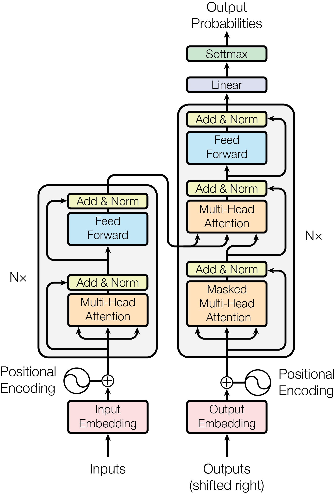

# Transformer

## Encoder

一般堆叠多个Encoder。

### Input Embedding & Position Encoding

原序列：$(seq\_len)$
词嵌入后：$(seq\_len,embed\_dim)$
叠加相同尺寸的位置编码

----

### Multi-Head Attention

多头自注意力对语义向量进行更新
单个自注意力头：
Q：$(seq\_len,d\_q)$
K：$(seq\_len,d\_k)$
V：$(seq\_len,d\_v)$
$(d\_q=d\_k)$
$(d\_v=embed\_dim/head\_num)$
让每个头专注一个低维子空间，实现多样化的注意力

自注意力权重矩阵：$(seq\_len,seq\_len)$  
每个token的Q查询整个输入序列，得到权重原始值
$$QK^T$$

|| $K_1$ | $K_2$ | $\cdots$ | $K_{seq\_len}$ |
|----|---|---|---|---|
| $Q_1$ | $Q_1 \cdot K_1$ | $Q_1 \cdot K_2$ | $\cdots$ | $Q_1 \cdot K_{seq\_len}$ |
| $Q_2$ | $Q_2 \cdot K_1$ | $Q_2 \cdot K_2$ | $\cdots$ | $Q_2 \cdot K_{seq\_len}$ |
| $\vdots$ | $\vdots$ | $\vdots$ | $\ddots$ | $\vdots$ |
| $Q_{seq\_len}$ | $Q_{seq\_len} \cdot K_1$ | $Q_{seq\_len} \cdot K_2$ | $\cdots$ | $Q_{seq\_len} \cdot K_{seq\_len}$ |

对V加权求和，得到语义向量的单头更新值：$(seq\_len,d_v)$
$$Z=softmax(\frac{QK^T}{\sqrt{d_k}})V$$

拼接各头输出：$(seq\_len,d_v\times head\_num)$

线性变换为最终更新值：$(seq\_len,embed\_dim)$

### Add & Norm

残差连接，并对每个token的语义向量单独归一化

$$\text { Output }=\text { LayerNorm }(x+\operatorname{SubLayer}(x))$$

输出：$(seq\_len,embed\_dim)$

----

### Feed Forward

对每个token的语义向量单独进行非线性变换。

映射至更高维度空间，再映射回原维度。

### Add & Norm

输出富含上下文信息的语义向量序列：$(seq\_len,embed\_dim)$

对语义向量序列，进行独立的线性变换，分别得到原序列的K、V矩阵：$(seq\_len,d\_k)$

----

## Decoder (Training)

一般堆叠多个Decoder。

### Input Embedding & Position Encoding (shifted right)

将正确目标序列右移一位（添加`<sos>`），作为输入

输出：$(target\_seq\_len, embed\_dim)$

----

### Masked Multi-Head Attention

使用多头自注意力更新所有语义向量。

更新时使用Causal Masking，当前token只能根据前面序列的信息来更新。

|     | $K_1$ | $K_2$ | $\cdots$ | $K_n$ |
|-----|--------|--------|----------|--------|
| $Q_1$ | ✅    | ❌    | $\cdots$ | ❌    |
| $Q_2$ | ✅    | ✅    | $\cdots$ | ❌    |
| $\vdots$ | $\vdots$ | $\vdots$ | $\ddots$ | $\vdots$ |
| $Q_n$ | ✅    | ✅    | $\cdots$ | ✅    |

即在softmax之前遮盖注意力权重矩阵的上三角。

输出：$(target\_seq\_len, embed\_dim)$  
以及每个token的Q向量

### Add & Norm

----

### Multi-Head Attention (cross-attention)

使用Encoder输出的K、V向量，和Decoder当前层的Q向量进行多头注意力计算。

目标序列的每个token都可以自由查询整个原序列的信息，然后更新语义向量。

所有Decoder的cross-attention层都使用由最后一个Encoder得到的K、V。

### Add & Norm

----

### Feed Forward

### Add & Norm

----

### Linear & Softmax

将每个token的语义向量映射为词表分布概率。一般使用$W_{\mathrm{out}}=W_{\mathrm{embed}}^T$

由于是右移的，当前token预测的是正确目标序列的下一个token。

如原序列`[I, love, you]`，
使用目标序列`[<sos>, 我, 爱]`预测`[我, 爱, ?]`。

----

## Decoder (Inference)

推理时，目标序列的每个token都是逐步生成的。

每生成一个token，则将整个生成序列返回为输入，预测下一个token。

实际上仅将新token输入Decoder，并利用先前缓存的K、V (包括masked self-attention 和 cross-attention层的KV)。